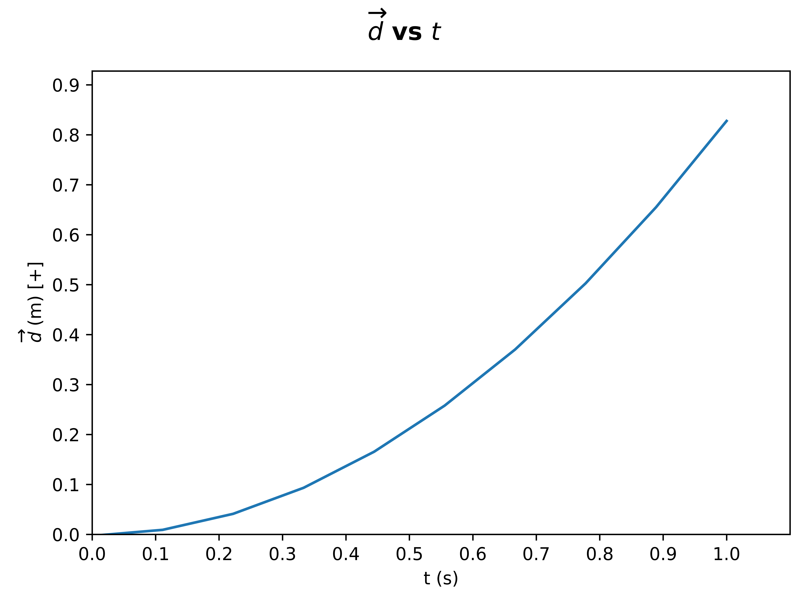
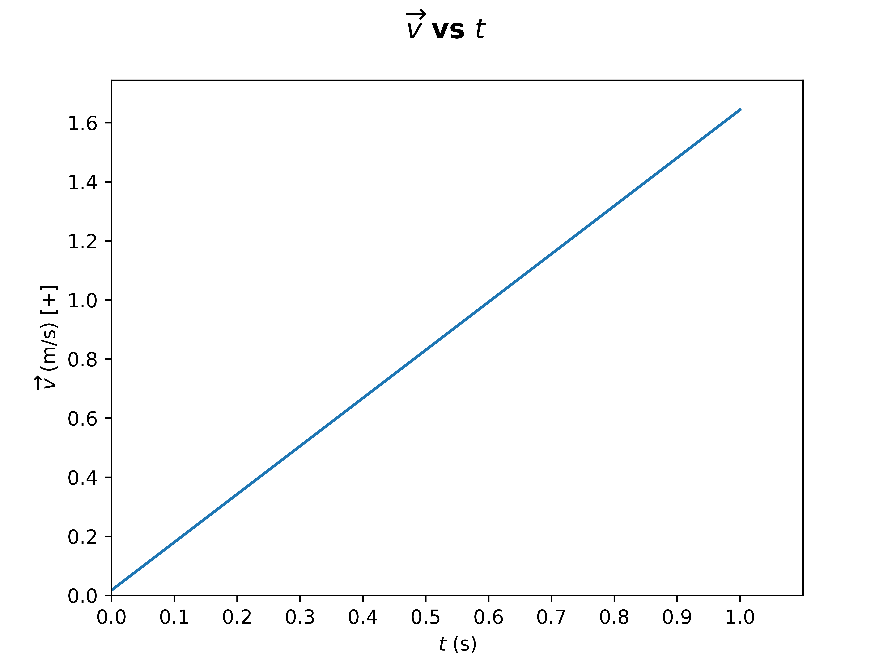
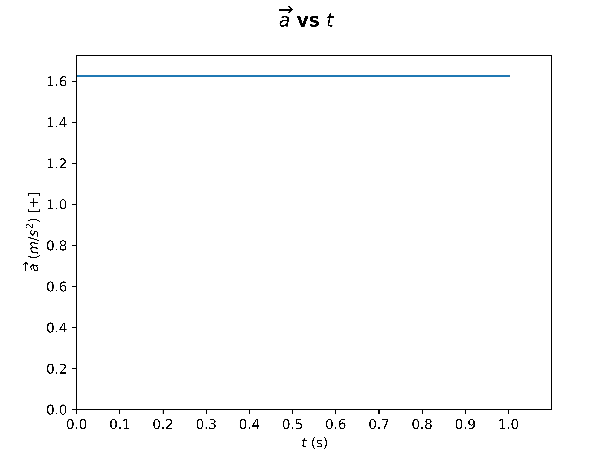
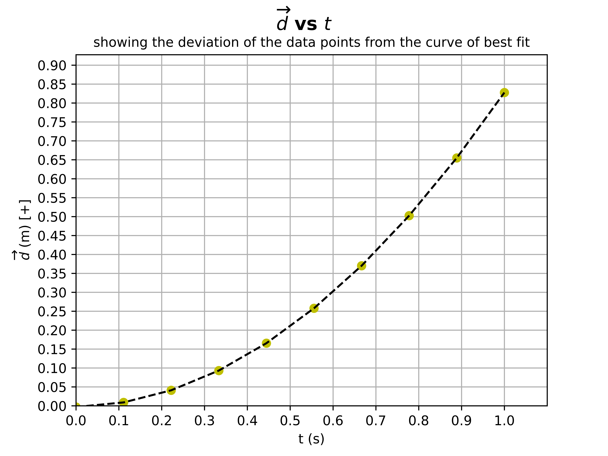
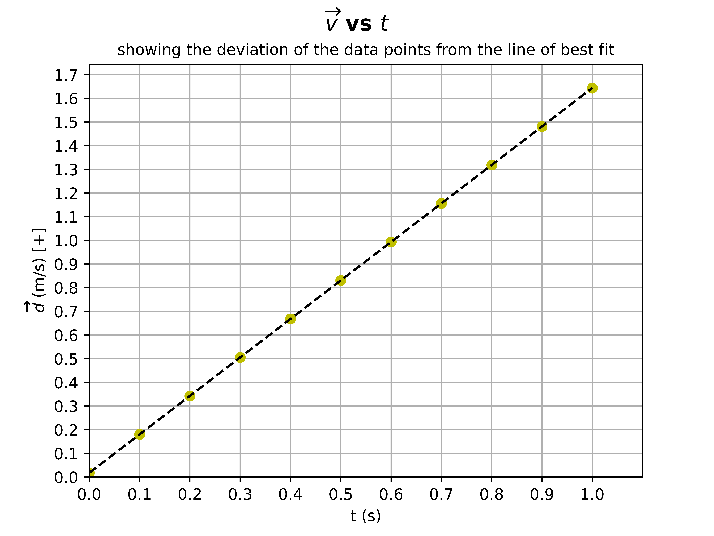

# SPH3U3 Ticker Tape Graph Generator

## Author: Mike Liang
### Date: 2022-09-27


**Description:** This program generates a $\overrightarrow{d} ~\text{vs}~ t$, $\overrightarrow{v} ~\text{vs}~ t$ graph for a given set of data.


# Sample Graphs








# Deviation Graphs








# Usage

## Requirements

- Python 3.6+

## Installation

```
$ pip install -r requirements.txt
$ python main.py
```

## Input
Follow the prompts after running main.py

## Changing Data

To change the data, modify the `data.py` file and add your own displacement data using the following format:

```python
name = [
  [times],
  [displacements],
]
```

# License
```
Copyright 2022 Mike Liang

Licensed under the Apache License, Version 2.0 (the "License"); you may not use this file except in compliance with the License.

You may obtain a copy of the License at

       http://www.apache.org/licenses/LICENSE-2.0

Unless required by applicable law or agreed to in writing, software distributed under the License is distributed on an "AS IS" BASIS,
WITHOUT WARRANTIES OR CONDITIONS OF ANY KIND, either express or implied. See the License for the specific language governing permissions and limitations under the License.
```